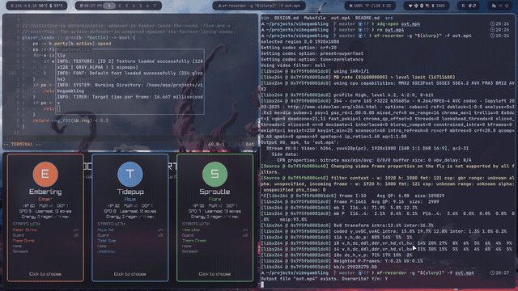

# Monster Colony

A hex-crawl **colony builder** set in an infinite underground. Build a colony on
procedurally generated terrain, feed and defend your monsters from roaming
wilds, and settle fights in a symmetric **deck-builder** battle engine.

Built with [Odin](https://odin-lang.org/) and [raylib](https://www.raylib.com/).

## 🎬 Demo



▶️ **[Watch the full-quality `out.mp4`](out.mp4)** (48s, 1080p)

> GitHub strips `<video>` tags in READMEs, so the inline preview above is an
> animated GIF (`demo.gif`). For a native inline player with sound, drag
> `out.mp4` into a GitHub issue/comment and replace the GIF line with the
> returned `https://github.com/user-attachments/assets/…` URL inside a
> `<video>` tag.

## Build & run

You need **Odin** with its bundled raylib bindings (and the usual raylib system
deps). Then:

```sh
make run     # compile & play
make build   # build bin/monster-colony
make check   # type-check only
make clean   # remove bin/
```

### Controls (colony)

| Key | Action |
|---|---|
| Left click | move to an adjacent tile / select a monster (click again to cycle stacked monsters) |
| `Tab` | cycle through your monsters |
| `Space` / `E` | end turn |
| `B` | build / repair / replace improvements |
| `T` | Trading Post (when standing on one) |
| `V` | view a monster's deck |
| `M` | monster encyclopedia |
| RMB / `WASD` | pan, wheel to zoom |

Battles are played with `1`–`5` / clicks to play cards, `E` to end your turn,
`C` to use a capture card, `T` to switch.

## Design

See [DESIGN.md](DESIGN.md) for the full spec, systems and phased roadmap.
